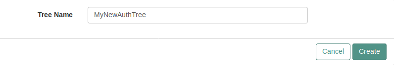
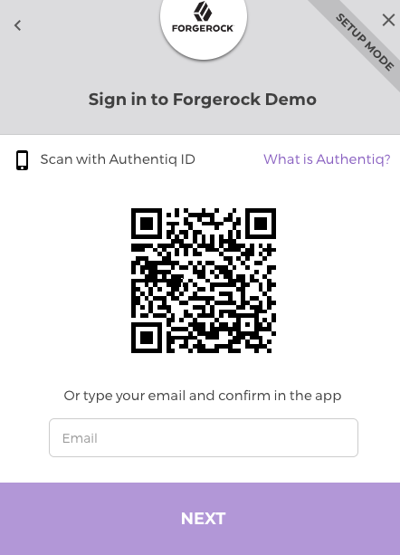

A passwordless authentication node for ForgeRock's Identity Platform, based on [Authentiq](https://www.authentiq.com/?utm_source=github&utm_medium=readme&utm_campaign=forgerock-social-authentiq).

# Introduction

[Authentiq](https://www.authentiq.com/?utm_source=github&utm_medium=readme&utm_campaign=forgerock-social-authentiq) is a delightful passwordless authentication solution to protect your applications. So why not also hook Authentiq to your enterprise applications via ForgeRock...

# Installation

## From JAR

Download the pre-built JAR from the [latest release](https://github.com/AuthentiqID/forgerock-social-authentiq-node/releases/latest) in this repository and copy it into the `tomcat/webapps/openam/WEB-INF/lib` directory of your OpenAM deployment.

Restart the web container, after which the node will be available as an authentication tree component.

## From source

Clone this repository, then run `mvn package` to build a local JAR file. 

Copy the `.jar` file from the `../target` directory into the `tomcat/webapps/openam/WEB-INF/lib` directory of your OpenAM deployment. 

Restart the web container, after which the node will be available as an authentication tree component.

# Configuration

To enable sign in with Authentiq:

- Optionally, from the **Authentication -> Trees** menu, create a new Authentication Tree, e.g. `MyNewAuthTree`
  
  

- Add the **Social Authentiq** node to your Auth Tree.  
- Attach the **Provision Dynamic Account** node to the **No account exists** connector as follows.

  

- Sign in to the [Authentiq Dashboard](https://dashboard.authentiq.com/?utm_source=github&utm_medium=readme&utm_campaign=forgerock-social-authentiq). If new to Authentiq, just press **What is Authentiq?** and type in your phone number while signing in.
- On the Dashboard, create a new **Server Side app** , providing a descriptive name, but leaving the remaining fields empty for now.
- Press **Save** and copy the `client_id` and `client_secret` for your application.
- In the **Social Authentiq** node's properties, fill out the `client_id` and `client_secret` you obtained above. You can likely leave the other fields at their defaults.
- Save the Auth Tree.

# Usage

To test your authentication flow:

- Navigate to the sign-in page of the authentication tree, e.g. `https://openam.partner.com:8080/openam/XUI/#login&service=MyNewAuthTree`.
- You will be redirected to the Authentiq sign-in page.

  

- Sign in with your Authentiq ID, installing it as you go if needed.

- Once you know the final **Redirect URI** for your application, go back to the Authentiq Dashboard and enter it in the corresponding field to exit setup mode.

# Future

- Update user profiles on subsequent logins (should become possible in OpenAM v6.5).
- Whitelist users by domain.
- Remote sign-out.

# Support

Get in touch with an Authentiq developer via [chat](https://www.authentiq.com/?utm_source=github&utm_medium=readme&utm_campaign=forgerock-social-authentiq) or [email](mailto:support@authentiq.com). We'd love to get a screenshot of your custom authentication trees!
